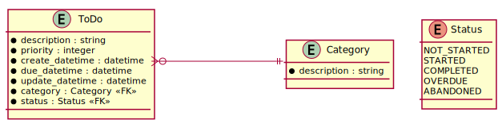

# PhoenixTodo Design

## Class Diagram


A ```ToDo``` item has the following attributes:

1. ```description``` - a brief description of the task
1. ```priority``` - 0 is lowest, 5 is highest
1. ```category``` - the category to which this item belongs
1. ```create_datetime``` - date *and* time at which this todo item was created
1. ```due_datetime``` - date *and* time before which this todo item needs to be completed
1. ```update_datetime``` - date *and* time at which this todo item was last updated. Might include changing the description or the status
1. ```status``` - current status of the todo item: one of the following
    
    1. ```NOT_STARTED``` - initial state of every todo
    1. ```STARTED``` - started but not completed
    1. ```COMPLETED``` - started *and* completed
    1. ```OVERDUE``` - After ```due_datetime``` has passed, *if* the todo has not been completed, it will be marked overdue. Upon completion, the todo will be placed in the ```COMPLETED``` state.
    1. ```ABANDONED``` - The todo has been abandoned.

## Functionality

1. The Categories need to be created upfront.
1. User can create a ```Todo``` item; upon creation, user **has to** specify the ```Category```. The ```Status``` 
    will automatically be set to ```NOT_STARTED```.
1. The user needs to explicitly start the todo.
1. The user can update the status of the todo.
1. The system will automatically mark todo items to the ```OVERDUE``` status if required, and display them in a 
    prominent fashion.